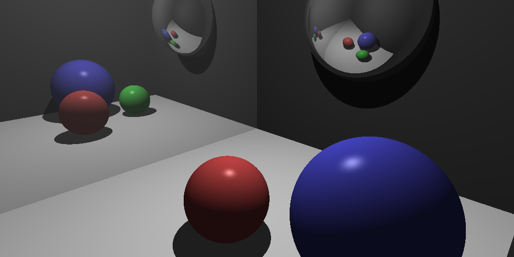

# Raytracer

This project is a basic raytracer implemented in C++ that renders 3D scenes using ray casting and simple lighting models.



## Getting Started

### Build Instructions

Build the project with `make`.
```bash
make all
```

Then run the project.
```bash
./raytracer
```
